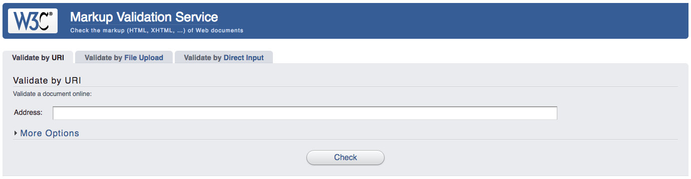

## Learning Competencies

* Mampu menggunakan [Semantic HTML](http://webstyleguide.com/wsg3/5-site-structure/2-semantic-markup.html) untuk membangun struktur dalam sebuah halaman web.
* Mampu menggunakan CSS selector untuk mengakses elemen-elemen DOM.
* Mampu menjelaskan perbedaan optimasi antara menggunakan CSS selector dengan CSS yang dipasang di elemen.
* Mampu merubah tampilan CSS seperti warna, lebar, margin, dsb.
* Mampu menempatkan elemen di tampilan menggunakan CSS.

## Summary

HTML digunakan untuk membuat struktur dalam sebuah halaman web. CSS digunakan untuk mempercantik tampilan sebuah halaman web. Dalam portfolio ini kamu akan menggunakan HTML dan CSS untuk membuat ulang sebuah halaman website yang telah ada sebelumnya.

## Releases

### Release 0: Memilih contoh web yang akan ditiru

Temukan sebuah halaman web yang merepresentasikan sesuatu hal yang kamu sukai. Misalnya [sepeda](http://polygonbikes.com/id). Halaman web yang kamu pilih harus yang sederhana tapi memiliki gambar dan tulisan.

* Screenshot halaman yang akan kamu tiru. Kamu akan menggunakan screenshot ini untuk referensi kamu. Kamu tidak boleh melihat HTML atau CSS yang digunakan pada web yang akan kamu tiru. Simpanlah file screenshot kamu pada repo.
* Buatlah direktori untuk gambar dan download-lah gambar-gambar yang ada di website yang kamu tiru, setelah itu simpan di direktori gambar yang telah kamu buat.

**Catatan Penting**

Semantic di sini bukan berarti menggunakan UI framework Semantic UI (walaupun dibolehkan menggunakan UI framework), melainkan, kita menggunakan elemen HTML dan CSS yang memenuhi kriteria berikut:

- Terdapat susunan dokumen HTML yang lengkap; `<!DOCTYPE html>`, `<head>`, `<meta>`, `<body>`, dan sebagainya.
- Tiap elemen HTML digunakan sesuai tujuan elemen tersebut. Misalnya untuk membuat header, kita menggunakan elemen `<header>` dan `<h1>`, bukan menggunakan `
` atau ``.
- Tiap elemen HTML yang penting, harus menyertakan `id` dan `class` yang sesuai. Misalnya pada sebuah elemen `<form>`, terdapat `id` unik (`id="signup-form"`) serta `class` untuk styling (`class="wide blue"`).

### Release 1: HTML

Buatlah struktur HTML menggunakan HTML5.

* Buatlah tag `<head>`, tambahkan file `styles.css` sebagai kode CSS kamu.
* Buatlah tag `<body>` dengan tag `<header>`, dan tag `<nav>` sebagai isi.
* Kamu dapat menyalin teks yang ada di web yang akan kamu tiru, ke dalam web kamu.
* Tambahkan semua gambar ke dalam halaman web-mu.
* Pastikan web-mu telah [tervalidasi](http://validator.w3.org) dengan baik.

### Release 2: Tambahkan CSS

Tambahkan CSS kamu pada halaman `styles.css` yang akan membuat tampilan web kamu seperti web yang ditiru.

* Gunakan Basic Selectors seperti id, class, dan element.
* Gunakan Advanced Selectors seperti sibling, pseudo, child, dan sebagainya.
* Gunakan Box Model Styles seperti margin, border, dan padding.
* Gunakan Position Styles seperti fixed, absolute, relative dan static.
* Gunakan Background Styles untuk warna dan gambar.
* Gunakan Font Styles.
* Gunakan CSS3 Styles seperti rounded border jika dibutuhkan pada gambar kamu.
* Gunakan Color Picker untuk mendapatkan warna yang sesuai.

Simpan file HTML dan CSS kamu pada direktori source.

### Release 3: SASS or SCSS (Optional)

Jika kamu dapat mengimplementasikan preprocessor CSS seperti SASS yang memungkinkan kamu untuk menggunakan berbagai fitur keren seperti variables, nesting, dan math maka lakukanlah.

### Optimalisasi pembelajaran kamu

Pastikan kamu menguasai CSS, tidak hanya mencoba-coba saja.

* Dapatkah kamu menjelaskan bagaimana kamu membuat setiap efeknya?
* Dapatkah kamu menjelaskan mengapa kamu membuat memilih beberapa properti CSS seperti display, float, dan positioning?
* Dapatkah kamu mengubah-ubah CSS kamu, sehingga navigation yang berada di paling atas pindah ke sebelah kiri. seberapa sulitkah kamu melakukannya?

Resources

* [Semantic HTML](http://webstyleguide.com/wsg3/5-site-structure/2-semantic-markup.html)
* [box model](http://css-tricks.com/the-css-box-model)
* [positioning](http://alistapart.com/article/css-positioning-101)
* [display](http://reference.sitepoint.com/css/display)
* [float](http://alistapart.com/article/css-floats-101)
* [normalize.css](http://necolas.github.io/normalize.css)
* [CSS Zen Garden](http://csszengarden.com)
* [SASS](http://sass-lang.com)
