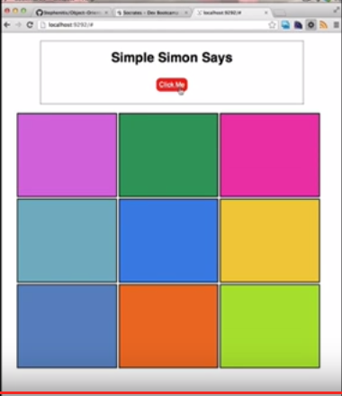

## Learning Competencies

* Mampu menuliskan custom event handlers di dalam JavaScript dan jQuery
* Mampu menggunakan AJAX untuk merubah tampilan secara asynchronous.
* Mampu menggunakan JSON untuk mengirimkan data melalui AJAX call serta dapat memanipulasi DOM

## Summary

Pada tantangan ini, tugasmu adalah menggunakan jQuery untuk mengimplementasikan behavior yang ditampilkan [dalam video ini](https://youtu.be/xKpJM0rtAvA).

**CATATAN:** Warna-warna baru diberikan setelah pengguna menekan tombol `Click Me`.

## Releases

### Release 0:

Ubahlah kode-kode yang ada untuk mengimplementasikan beberapa fungsi di bawah ini:

* Tombol `Click Me` yang dapat ditekan dan melakukan **Ajax request** ke API `/colors`.
* Mengembalikan sebuah JSON object yang berisi warna acak dan nomor dari box.
* Merubah background color sesuai dengan warna yang dipilih pada box, tanpa merubah HTML.

## Optimize Your Learning

Ketika kamu selesai, pastikan:

* Pastikan kode-kode yang kamu buat menghasilkan tampilan yang sesuai dengan yang ditunjukkan di video.
* Kode kamu sudah rapi.
* kamu dapat menjelaskan secara gamplang bagaimana kode-kodemu menyelesaikan tugas yang diminta.
